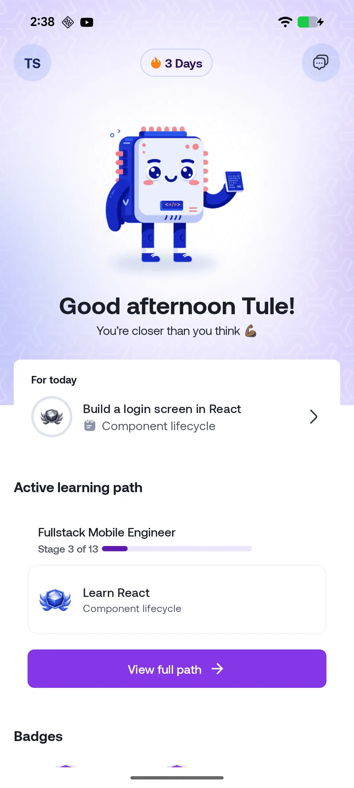
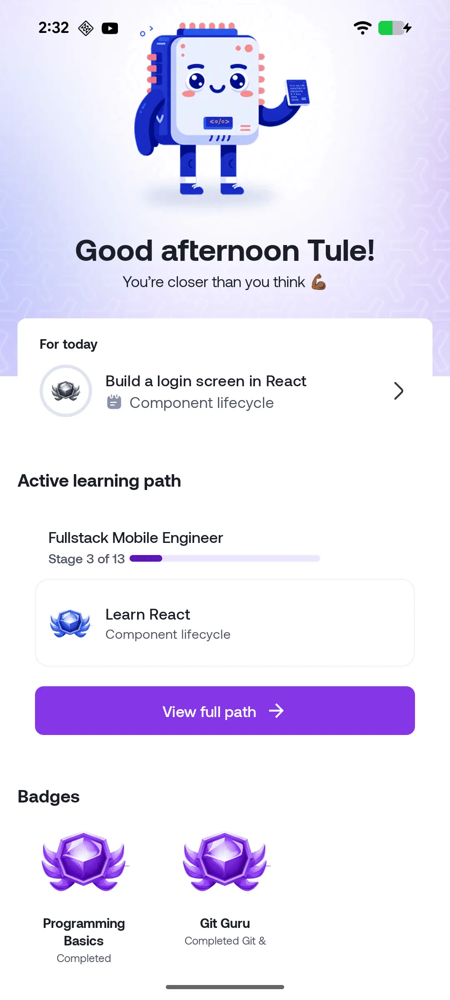
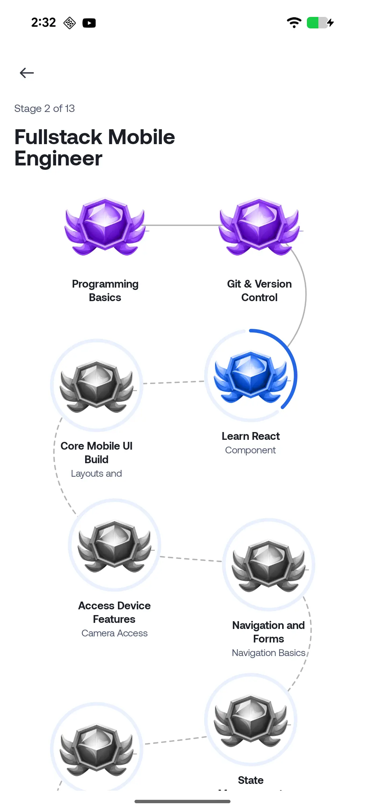
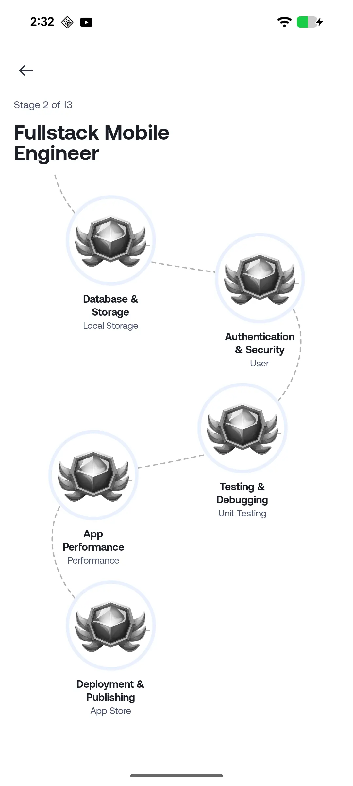
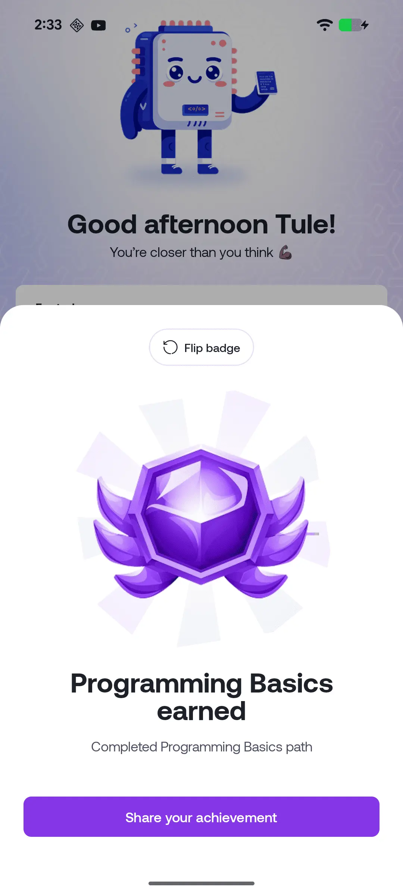

# Grey Assessment - Learning Path App

A modern Android learning path application built with Jetpack Compose, demonstrating clean architecture principles, custom theming, and smooth animations.

**Author:** Tule Simon
**Assessment For:** Grey
**Figma Design:** [Mobile Engineer Task](https://www.figma.com/design/kGNoaeVy0jw09PNnfLOJ0J/Mobile-engineer-task?node-id=0-1&p=f&t=2zVppVmNUHbIS9DB-0)

---

## Demo

### Video Preview

<p align="center">
  
</p>

### Screenshots

<p align="center">
  
  
  
  
  
</p>

---

## Architecture

This project follows **Clean Architecture** with **MVVM** pattern, ensuring separation of concerns, testability, and maintainability.

```
┌─────────────────────────────────────────────────────────────────────────────┐
│                              PRESENTATION LAYER                              │
│  ┌─────────────────┐    ┌─────────────────┐    ┌─────────────────────────┐  │
│  │    Screens      │    │   ViewModels    │    │      UI Components      │  │
│  │                 │◄───│                 │    │                         │  │
│  │ • HomeScreen    │    │ • HomeViewModel │    │ • PathsCustomComponent  │  │
│  │ • LearningPath  │    │ • LearningPath  │    │ • BadgeAchievement      │  │
│  │   Screen        │    │   ViewModel     │    │   BottomSheet           │  │
│  └─────────────────┘    └────────┬────────┘    │ • LevelBadgeItem        │  │
│                                  │             └─────────────────────────┘  │
├──────────────────────────────────┼──────────────────────────────────────────┤
│                              DOMAIN LAYER                                    │
│                                  │                                           │
│  ┌───────────────────────────────▼───────────────────────────────────────┐  │
│  │                           Use Cases                                    │  │
│  │  • GetHomeDataUseCase    • GetLearningPathUseCase                     │  │
│  │  • CompleteTaskUseCase                                                 │  │
│  └───────────────────────────────┬───────────────────────────────────────┘  │
│                                  │                                           │
│  ┌───────────────────────────────▼───────────────────────────────────────┐  │
│  │                      Domain Models & Repository Interface              │  │
│  │  • User  • Badge  • Task  • Topic  • Path  • Course                   │  │
│  │  • LearningRepository (interface)                                      │  │
│  └───────────────────────────────┬───────────────────────────────────────┘  │
├──────────────────────────────────┼──────────────────────────────────────────┤
│                               DATA LAYER                                     │
│                                  │                                           │
│  ┌───────────────────────────────▼───────────────────────────────────────┐  │
│  │                    LearningRepositoryImpl                              │  │
│  │                            │                                           │  │
│  │              ┌─────────────▼─────────────┐                            │  │
│  │              │    MockLearningDataSource │                            │  │
│  │              │    (Static test data)     │                            │  │
│  │              └───────────────────────────┘                            │  │
│  └────────────────────────────────────────────────────────────────────────┘ │
└─────────────────────────────────────────────────────────────────────────────┘
```

### Project Structure

```
app/src/main/java/com/simon/greyassesment/
├── data/
│   ├── datasource/
│   │   └── MockLearningDataSource.kt      # Static mock data
│   └── repository/
│       └── LearningRepositoryImpl.kt      # Repository implementation
│
├── di/
│   └── AppModule.kt                       # Hilt dependency injection
│
├── domain/
│   ├── model/
│   │   └── LearningModels.kt              # Domain models (User, Badge, Task, etc.)
│   ├── repository/
│   │   └── LearningRepository.kt          # Repository interface
│   └── usecase/
│       ├── GetHomeDataUseCase.kt
│       ├── GetLearningPathUseCase.kt
│       └── CompleteTaskUseCase.kt
│
├── features/
│   ├── home/
│   │   └── presentation/
│   │       ├── screens/
│   │       │   └── LearningHomeScreen.kt
│   │       ├── viewmodel/
│   │       │   └── HomeViewModel.kt
│   │       └── components/
│   │           └── ...
│   │
│   └── learnpath/
│       └── presentation/
│           ├── screens/
│           │   └── LearningPathHomeScreen.kt
│           ├── viewModel/
│           │   └── LearningPathViewModel.kt
│           └── components/
│               ├── PathsCustomComponentBySimon.kt
│               └── BadgeAchievementBottomSheet.kt
│
├── navigation/
│   └── AppNavGraph.kt                     # Type-safe navigation
│
└── ui/
    ├── theme/
    │   ├── Color.kt
    │   ├── Type.kt
    │   ├── Shape.kt
    │   ├── spacing.kt
    │   └── Theme.kt
    └── components/
        └── GreyButton.kt                  # Reusable UI components
```

---

## Tech Stack

| Category | Technology |
|----------|------------|
| **Language** | Kotlin 2.2 |
| **UI Framework** | Jetpack Compose |
| **Architecture** | Clean Architecture + MVVM |
| **Dependency Injection** | Hilt |
| **Navigation** | Navigation Compose (Type-safe) |
| **Async** | Kotlin Coroutines + Flow |
| **Image Loading** | Coil |
| **Testing** | JUnit, MockK, Turbine |
| **Build System** | Gradle with Kotlin DSL |
| **Min SDK** | 24 (Android 7.0) |
| **Target SDK** | 36 |

---

## Custom Theming System

The app implements a comprehensive custom theming system that extends Material 3 with Grey-specific design tokens.

### Colors (`GreyColors`)

```kotlin
MaterialTheme.greyColors.textDefault      // Primary text
MaterialTheme.greyColors.textSoft         // Secondary text
MaterialTheme.greyColors.primary          // Brand purple (#8636E8)
MaterialTheme.greyColors.buttonContainer  // Button background
MaterialTheme.greyColors.badgeProgress    // Progress indicators
MaterialTheme.greyColors.pathStroke       // Learning path lines
```

### Typography (`GreyTypography`)

Built on the **Aeonik** font family with a complete type scale:

```kotlin
MaterialTheme.greyTypography.headingLarge   // 32sp Bold
MaterialTheme.greyTypography.headingMedium  // 24sp Bold
MaterialTheme.greyTypography.headingSmall   // 20sp Bold
MaterialTheme.greyTypography.titleLarge     // 18sp Bold
MaterialTheme.greyTypography.titleMedium    // 16sp Bold
MaterialTheme.greyTypography.bodyLarge      // 16sp Normal
MaterialTheme.greyTypography.bodyMedium     // 14sp Normal
MaterialTheme.greyTypography.bodySmall      // 12sp Normal
MaterialTheme.greyTypography.labelLarge     // 14sp Bold
MaterialTheme.greyTypography.buttonLarge    // 16sp Bold
```

### Spacing (`GreySpacing`)

Consistent spacing tokens for layouts:

```kotlin
MaterialTheme.greySpacing.spacing4   // 4.dp
MaterialTheme.greySpacing.spacing6   // 6.dp
MaterialTheme.greySpacing.spacing8   // 8.dp
MaterialTheme.greySpacing.spacing11  // 11.dp
MaterialTheme.greySpacing.spacing14  // 14.dp
MaterialTheme.greySpacing.spacing16  // 16.dp
MaterialTheme.greySpacing.spacing25  // 25.dp
MaterialTheme.greySpacing.spacing28  // 28.dp
```

### Shapes (`GreyShapes`)

Predefined corner radius for components:

```kotlin
MaterialTheme.greyShapes.small       // 8.dp rounded
MaterialTheme.greyShapes.medium      // 12.dp rounded
MaterialTheme.greyShapes.large       // 16.dp rounded
MaterialTheme.greyShapes.full        // Fully rounded (pill)
MaterialTheme.greyShapes.card        // 8.dp (card corners)
MaterialTheme.greyShapes.button      // 8.dp (button corners)
MaterialTheme.greyShapes.bottomSheet // 24.dp top corners
```

### Usage Example

```kotlin
@Composable
fun MyComponent() {
    Text(
        text = "Hello",
        style = MaterialTheme.greyTypography.headingMedium.copy(
            color = MaterialTheme.greyColors.textDefault
        ),
        modifier = Modifier.padding(MaterialTheme.greySpacing.spacing16)
    )
}
```

---

## Animations

The app features smooth, polished animations to enhance user experience:

### Learning Path Reveal Animation
- **Sequential path drawing** using `PathMeasure` to progressively reveal connecting lines
- **Badge pop-in effect** with spring physics (`DampingRatioMediumBouncy`)
- **Staggered timing** - each badge appears as its incoming path completes

### Badge Achievement Bottom Sheet
- **Rotating light rays** drawn with Canvas, creating a celebration effect
- **Badge scale animation** with spring bounce on entrance
- **Flip animation** - tap "Flip badge" to see a 3D card flip effect
- **Pulsing glow** effect on the light rays background

### Navigation Transitions
- **Fade + Slide** transitions between screens
- **Smooth enter/exit** animations for natural flow

---

## Testing

The project includes comprehensive unit tests:

```
app/src/test/
├── domain/
│   ├── model/
│   │   └── LearningModelsTest.kt          # Domain model tests
│   └── usecase/
│       ├── GetHomeDataUseCaseTest.kt
│       ├── GetLearningPathUseCaseTest.kt
│       └── CompleteTaskUseCaseTest.kt
│
├── data/
│   └── repository/
│       └── LearningRepositoryImplTest.kt  # Repository tests
│
└── features/
    ├── home/
    │   └── presentation/viewmodel/
    │       └── HomeViewModelTest.kt       # ViewModel tests
    └── learnpath/
        └── viewModel/
            └── LearningPathViewModelTest.kt
```

### Run Tests

```bash
# Run all unit tests
./gradlew test

# Run with coverage
./gradlew testDebugUnitTest
```

---

## Building & Running

### Prerequisites
- Android Studio Hedgehog or newer
- JDK 21
- Android SDK 36

### Steps

1. Clone the repository
```bash
git clone https://github.com/TuleSimon/Grey-Assessment.git
cd GreyAssesment
```

2. Open in Android Studio

3. Sync Gradle files

4. Run on emulator or device
```bash
./gradlew installDebug
```

---

## Key Features

- **Home Screen** - Personalized greeting, daily tasks, learning progress overview
- **Learning Path** - Visual snake-like path with animated badges and progress indicators
- **Badge System** - Earn badges for completing learning paths
- **Achievement Celebration** - Animated bottom sheet when earning a badge
- **Progress Tracking** - Track completion across courses, paths, topics, and tasks

---

## License

This project is created as part of an assessment for Grey.

---

<p align="center">
  <b>Built with Jetpack Compose</b>
</p>